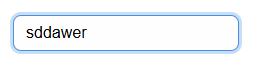
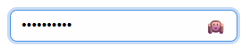
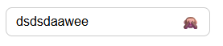
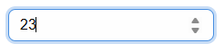
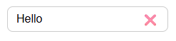
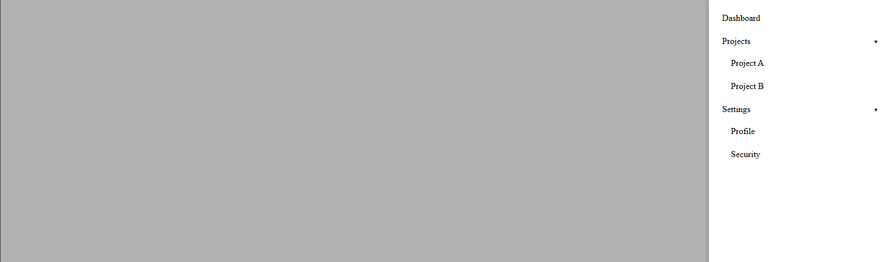
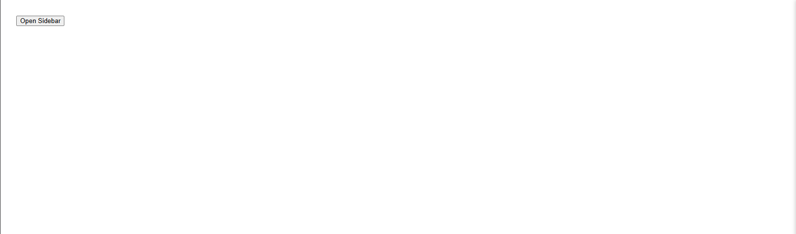
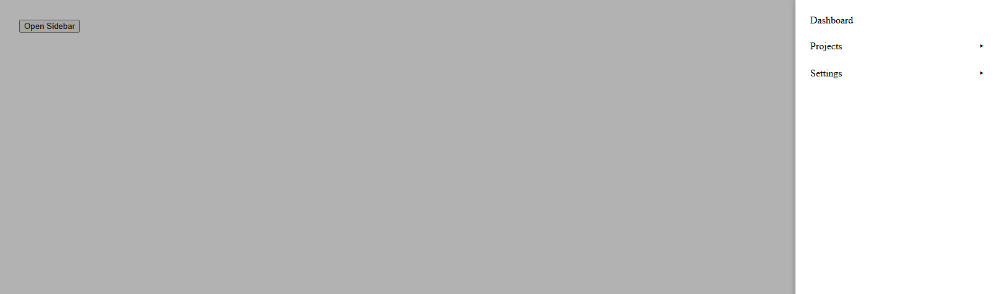

## Component Library with Storybook (React + TypeScript + Vite)

Small UI component library built with React, TypeScript, Vite and Storybook.  
Includes three reusable components:

- **Input**
- **SidebarMenu**
- **Toast**

Storybook is configured and can be run locally via `npm run storybook`.

---

## Setup & Scripts

- **Install dependencies**

```bash
npm install
```

- **Run the dev app (Vite)**

```bash
npm run dev
```

- **Run Storybook**

```bash
npm run storybook
```

---

## Component Overview

### **Input**

Located in `src/components/Input`.

- **Description**: Text field with optional password visibility toggle and clear button.
- **Key props** (see `Input.types.ts`):
  - **`type`**: `'text' | 'password' | 'number'` - HTML input type.
  - **`value`**: Controlled initial value (internal state is managed via `useState`).
  - **`placeholder`**: Placeholder text.
  - **`clearable`**: Shows a clear (`❌`) button when there is text.
  - **`onChange`**: Callback receiving the updated string value.
- **States covered in Storybook** (`src/stories/Input.stories.tsx`):
  - **Text** - basic text input.
  - **Password** - password input with show/hide toggle.
  - **Number** - numeric input.
  - **Clearable** - text input with clear button and pre‑filled value.

### **SidebarMenu**

Located in `src/components/SidebarMenu`.

- **Description**: Overlay sidebar with nested expandable menu items.
- **Key props** (see `SidebarMenu.types.ts`):
  - **`items`**: Array of `SidebarItem` objects (`label`, `key`, optional `children`).
  - **`open`**: Controls whether the sidebar is visible.
  - **`onClose`**: Called when backdrop is clicked.
- **States covered in Storybook** (`src/stories/SidebarMenu.stories.tsx`):
  - **Open** - sidebar visible with nested menu.
  - **Closed** - sidebar hidden.
  - **Interactive** - button to programmatically open/close the sidebar.

### **Toast**

Located in `src/components/Toast`.

- **Description**: Timed toast notification with optional close button.
- **Key props** (see `Toast.types.ts`):
  - **`message`**: Text content.
  - **`type`**: `'success' | 'error' | 'info'` - controls color/style.
  - **`duration`**: Time in ms before auto‑hide.
  - **`onClose`**: Called after the toast has fully closed.
  - **`closable`**: Shows a manual close (`✖`) button.
- **States covered in Storybook** (`src/stories/Toast.stories.tsx`):
  - **Success** - green success toast.
  - **Error** - error toast.
  - **Info** - informational toast.
  - **Closable** - long‑lived toast with close button.
  - **Interactive** - toast that disappears when closed.

---

## Storybook Usage

- **Start Storybook locally**

```bash
npm run storybook
```

This will start Storybook at `http://localhost:6006` where you can:

- **Browse components** under:
  - `Components/Input`
  - `Navigation/SidebarMenu`
  - `Feedback/Toast`
- **Switch between stories** to see different states of each component.
- **Use Storybook controls** (where enabled) to tweak props in real time.

---

## Screenshots

### **Storybook UI**

- **Storybook overview**


### **Input Component (multiple states)**

- **Default text input**



- **Password with toggle**




- **Number input & clearable**




### **SidebarMenu Component (multiple states)**

- **Sidebar open with nested items**



- **Sidebar closed / overlay**


- **Interactive open/close**




### **Toast Component (multiple states)**

- **Success / Error / Info**


- **Closable and interactive**


